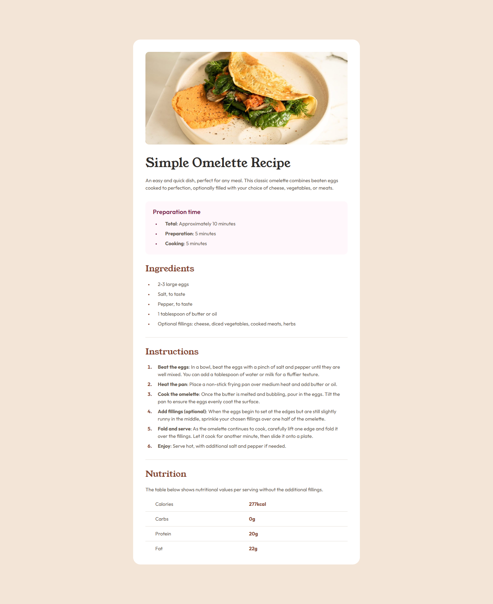

# Frontend Mentor - Recipe page solution

This is a solution to the [Recipe page challenge on Frontend Mentor](https://www.frontendmentor.io/challenges/recipe-page-KiTsR8QQKm). Frontend Mentor challenges help you improve your coding skills by building realistic projects. 

## Table of contents

- [Overview](#overview)
  - [Screenshot](#screenshot)
  - [Links](#links)
- [My process](#my-process)
  - [Built with](#built-with)
  - [What I learned](#what-i-learned)
  - [Continued development](#continued-development)
  - [Useful resources](#useful-resources)
- [Author](#author)
- [Acknowledgments](#acknowledgments)

## Overview

### Screenshot

### Links

- Solution URL: [https://github.com/Praise25/Recipe-page](https://github.com/Praise25/Recipe-page)
- Live Site URL: [https://recipe-page-swart-zeta.vercel.app/](https://recipe-page-swart-zeta.vercel.app/)

## My process

### Built with

- [React](https://reactjs.org/)
- [Typescript](https://www.typescriptlang.org/)

### What I learned

I learnt more about responsive design using media queries, as well as giving appropriate sizes to screen layouts when
they lack content. I also learnt more about styling unordered and ordered lists, primarily spacing betwen the markers and the outer body, as well as between the markers and the list content, resizing and recoloring list markers and even creating custom list markers. Finally, I was able to learn more about manipulating the layout of a table using flexbox.

## Author

- Frontend Mentor - [@Praise25](https://www.frontendmentor.io/profile/Praise25)
- Twitter - [@PraiseTheDev](https://x.com/PraiseTheDev)
- LinkedIn - [Anene Praise](https://www.linkedin.com/in/praise-anene-07776416a/)